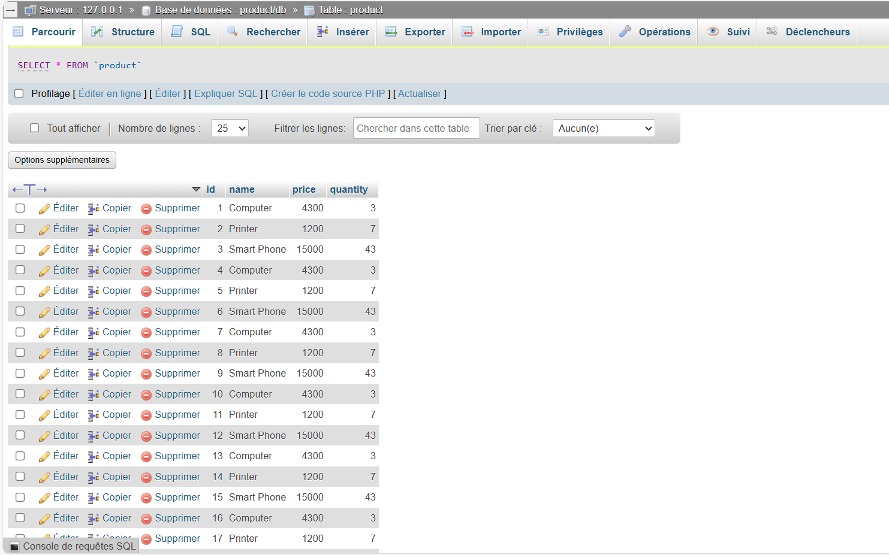
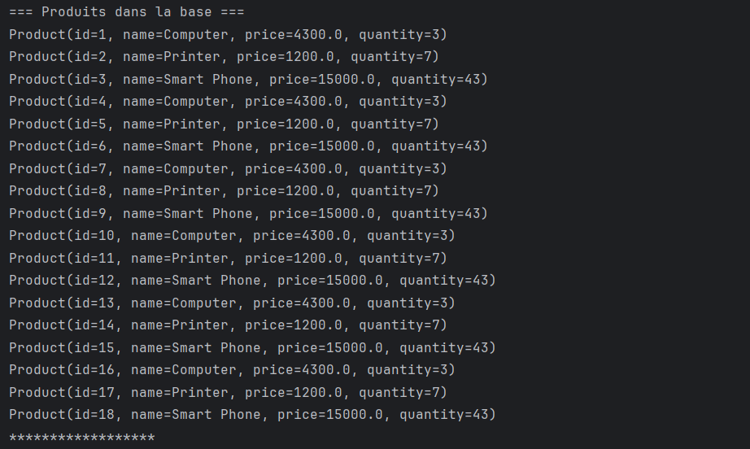

<h2>Sortie de mon code :</h2>

<h2>Affichage sur le web</h2>

<h2>Affichage via --http://localhost:8085/products--</h2>

<h2>Affichage sur terminal des produits existants</h2>

<h2>Le tri par id sur terminal</h2>

<h2>Le tri par id sur browser</h2>
